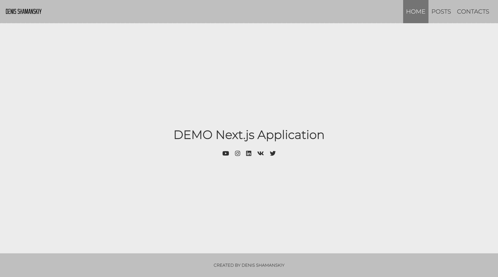

# Demo Next.js

## Описание

Небольшой демо-проект для знакомства с фреймворком [Next.js](https://nextjs.org/)

Размещен на [Vercel](https://demo-next-js-brown.vercel.app/) 

## Рассмотрены основные концепции

- Роутинг
- Создание страниц и компонентов
- Навигация по страницам
- Картинки и метаданные
- Запрос данных
- Динамические роуты
- Создание API
- SSR (Server Side Rendering)
- SSG (Static Site Generation)

## Построен на

